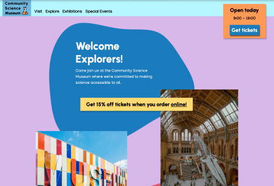

# Community Science Museum



## 🚀 About the Project
Community Science Museum is a fictional website showcasing the capabilities of HTML and CSS in creating visually appealing and responsive web designs. Designed as a static site, it demonstrates how fundamental web technologies can be leveraged to build engaging and aesthetically pleasing web pages without the need for complex backend infrastructure.

## 🎨 Features
- 🎨 **Pure HTML and CSS Design** – Utilizes core web technologies for structure and styling.
- 📱 **Responsive Layout** – Ensures an optimal viewing experience across a wide range of devices.
- ✨ **Modern Aesthetics** – Showcases CSS’s versatility in web design.
- 🌍 **Cross-Browser Compatibility** – Tested for seamless performance across multiple browsers.

## 🌍 Live Demo
Visit the live site: [Community Science Museum](https://csmuseum-lily.netlify.app/)

## 🛠️ Tech Stack
- **Frontend**: HTML5, CSS3
- **Design**: Figma

## 📦 Installation & Setup
To view or modify this project, follow these steps:

### 1️⃣ Clone the Repository
```bash
git clone https://github.com/thislily/Community-Science-Museum.git
cd Community-Science-Museum
```

### 2️⃣ Open the Project
No dependencies are required. Simply open `index.html` in a web browser.

## 📬 Contact
For any inquiries or feedback, feel free to reach out:
📧 [lilywatson.dev@gmail.com](mailto:lilywatson.dev@gmail.com)

---
**Made by Lily Watson**

